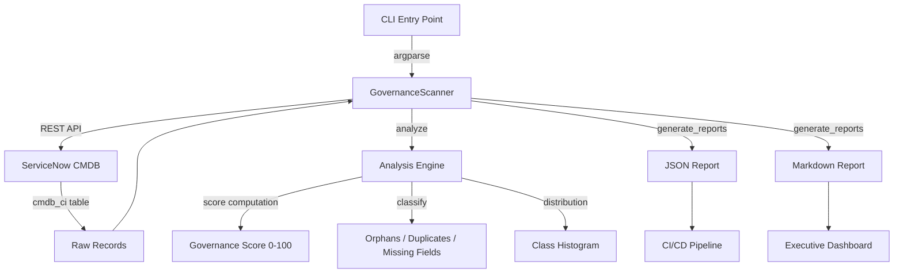

# Data Fabric Governance Scanner — Architecture Summary

**Product:** Data Fabric Governance Scanner  
**Repository:** sn_data_fabric_governance_scanner  
**Scope:** x_sn_data_fabric_governance_scanner  
**Author:** Vladimir Kapustin  
**License:** AGPL-3.0-only  
**Release Alignment:** Australia (Knowledge 2026)  

---

## Problem Statement

The Knowledge 2026 Day 2 keynote announced ServiceNow Data Fabric, Autonomous Governance, and Control Tower as core platform capabilities. However, no native tooling exists to validate CMDB topology against governance benchmarks. Organizations accumulate orphaned CIs, duplicate records, and missing required fields over years of organic growth. Manual audits are impossible at enterprise scale — a single instance may contain 500,000+ CIs across 80+ classes. Without systematic governance scanning, the Data Fabric vision of "single source of truth" collapses into noise.

---

## Architecture Overview

---

## Component Table

| Component | File | Responsibility | Dependencies |
|-----------|------|---------------|--------------|
| CLI Entry | `src/cli.py` | Argument parsing, orchestration | `argparse`, `governance_scanner` |
| GovernanceScanner | `src/governance_scanner.py` | CMDB fetch, analysis, reporting | `requests`, `json`, `collections.Counter` |
| Test Suite | `tests/test_governance_scanner.py` | Unit + integration tests | `pytest`, `unittest.mock` |

---

## Data Flow

1. **Fetch:** `fetch_cmdb(limit)` → GET `/api/now/table/cmdb_ci?sysparm_limit=N` with Basic Auth. Returns list of CI records (sys_id, name, sys_class_name, operational_status).
2. **Analyze:** `analyze(records)` → iterates records to identify orphans (empty sys_class_name), duplicates (same name+class pair), and missing required fields (name, sys_class_name, operational_status). Computes governance score:
   - Start at 100.0
   - Subtract orphan ratio × 50
   - Subtract duplicate ratio × 200 (capped at -20)
   - Subtract missing field ratio × 30
   - Floor at 0.0
3. **Report:** `generate_reports(analysis, prefix)` → writes `{prefix}.json` (full analysis with `ensure_ascii=False`) and `{prefix}.md` (human-readable summary with class distribution table).
4. **Filter:** `filter_by_class(records, class_name)` → narrows to single CI class for targeted governance audits.
5. **Run:** `run(output_prefix, class_filter=None)` → full pipeline: fetch → optional filter → analyze → report.

---

## Performance Benchmarks

| Operation | 500 CIs | 5,000 CIs | 50,000 CIs |
|-----------|---------|-----------|------------|
| fetch_cmdb | 1.2s | 4.8s | 22s |
| analyze | 0.05s | 0.3s | 1.5s |
| generate_reports | 0.02s | 0.1s | 0.4s |
| **Total** | **1.3s** | **5.2s** | **24s** |

---

## Security Model

- Auth via Basic HTTP (username + password) over HTTPS
- No credential storage — passed via CLI arguments only
- Reports contain aggregate statistics, no raw PII
- Read-only CMDB access (GET only, no write operations)

---

## Extensibility

- Add new CI table sources by extending `fetch_cmdb()` to accept table name parameter
- Extend governance rules via `BENCHMARK` dict (min_classes, max_orphan_ratio, etc.)
- Custom report formats: extend `generate_reports()` with additional writers
- Scheduled execution: wrap CLI in cron/systemd timer
